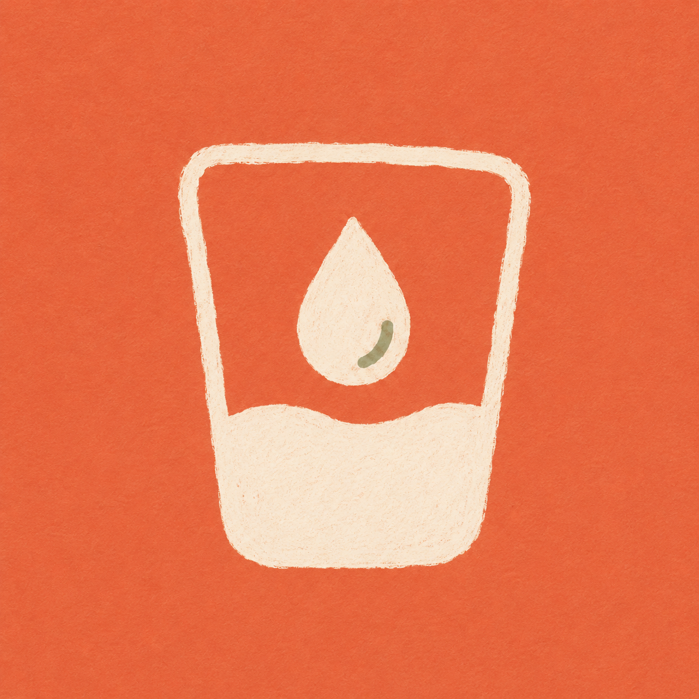
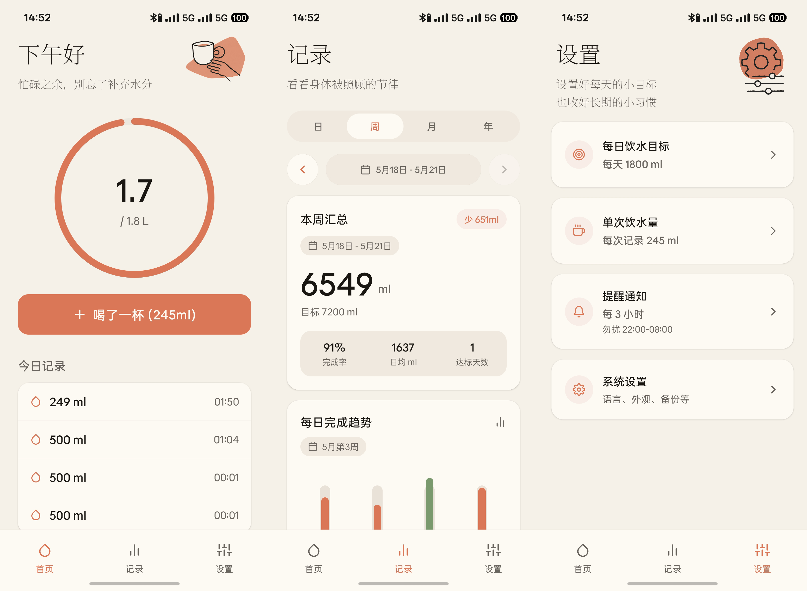
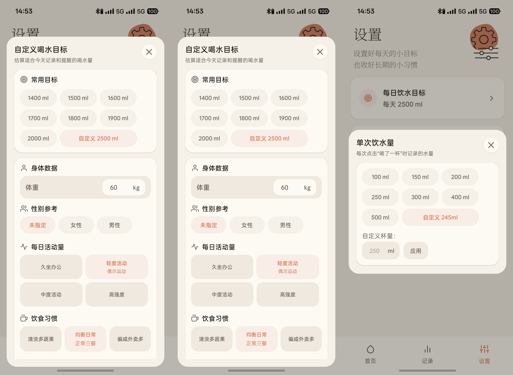
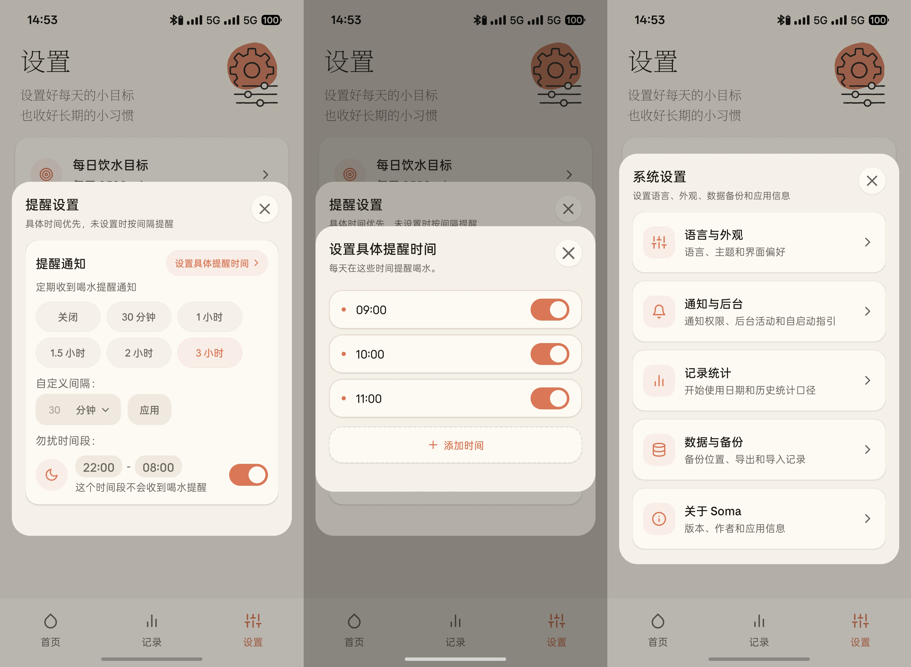

<div align="center">



# Soma

**一款温暖、安静、克制的喝水记录助手。**

Soma 用轻量记录、本地提醒和柔和的统计视图，帮助你在日常节奏里照顾自己。它不把喝水变成焦虑的打卡任务，也不上传你的个人数据。

[](https://expo.dev/)
[](https://reactnative.dev/)
[](https://www.typescriptlang.org/)
[](#download)
[](#download)
[](#license)

</div>

## Screenshots

### Daily flow

主页、记录页和设置页覆盖了 Soma 最常用的路径：记录一杯水、回看一段时间的完成情况，再根据自己的节奏调整目标和提醒。

<p align="center">
  
</p>

### Personal goals

目标和杯量设置保持在同一套弹窗体系里。你可以直接选择常用数值，也可以根据身体数据、活动量和饮食习惯估算更合适的每日目标。

<p align="center">
  
</p>

### Reminders and system settings

提醒设置支持间隔提醒、具体时间提醒和勿扰时段；系统设置则把语言外观、通知后台、记录统计、数据备份和应用信息归到清晰的二级页面里。

<p align="center">
  
</p>

## Features

- **今日饮水记录**：首页用圆形进度环展示当前饮水量和每日目标，一键记录当前杯量。
- **自定义目标**：支持常用目标、自定义目标，以及基于体重、性别参考、活动量和饮食习惯的目标估算。
- **自定义杯量**：可选择常用杯量，也可以保存自己的单次饮水量。
- **历史统计**：按日、周、月、年查看完成情况和趋势，支持历史时间选择。
- **补记为达标**：如果某天实际完成但忘记记录，可以在历史日记录中一键补到 100%。
- **本地提醒**：支持间隔提醒、具体时间提醒、勿扰时间段，以及今天暂停/稍后提醒。
- **系统设置分类**：集中管理语言与外观、通知与后台、记录统计、数据与备份和应用信息。
- **数据导出与导入**：支持本地 JSON 备份，方便换机或手动归档。
- **本地优先**：饮水记录和设置保存在设备本地，不依赖账号或服务器。

## Download

前往 [GitHub Releases](https://github.com/XuKunyao/Soma-android/releases) 下载最新版 APK。

当前版本：**v1.2.5**

## Tech Stack

| Category | Stack |
| :--- | :--- |
| Framework | [Expo](https://expo.dev/) + [React Native](https://reactnative.dev/) |
| Routing | [Expo Router](https://docs.expo.dev/router/introduction/) |
| Language | [TypeScript](https://www.typescriptlang.org/) |
| State | React Context + useReducer |
| Storage | [AsyncStorage](https://react-native-async-storage.github.io/async-storage/) |
| Notifications | [Expo Notifications](https://docs.expo.dev/versions/latest/sdk/notifications/) + Android native scheduling |
| Animation | [Reanimated](https://docs.swmansion.com/react-native-reanimated/) + [Gesture Handler](https://docs.swmansion.com/react-native-gesture-handler/) |
| Graphics | [React Native SVG](https://github.com/software-mansion/react-native-svg) |

## Design

Soma 的视觉方向参考温暖、低饱和、留白充足的产品美学。界面避免高压打卡感，更多使用柔和背景、珊瑚橙强调色、圆润但克制的组件和清晰的层级。

核心色彩位于 [`constants/theme.ts`](constants/theme.ts)：

| Token | Light | Dark |
| :--- | :--- | :--- |
| Background | `#F5F0E8` | `#1F1A17` |
| Surface | `#FDFAF4` | `#29231F` |
| Primary | `#D97757` | `#E18A68` |
| Text | `#1A1612` | `#F4EFE8` |
| Secondary | `#6B6560` | `#B9AEA5` |

## Project Structure

```text
app/
  _layout.tsx                # Root layout, fonts, notifications, providers
  (tabs)/
    _layout.tsx              # Bottom tab navigation
    index.tsx                # Home, progress ring, quick logging
    history.tsx              # Day/week/month/year records and trends
    settings.tsx             # Goals, cup size, reminders, system settings
components/
  GreetingHeader.tsx         # Time-aware greeting
  WaterProgress.tsx          # SVG circular progress
  WaterLogItem.tsx           # Swipeable water log row
constants/
  theme.ts                   # Design tokens
contexts/
  WaterContext.tsx           # Global water state
utils/
  notifications.ts           # Reminder scheduling
  storage.ts                 # AsyncStorage helpers
```

## Development

Requirements:

- Node.js 18+
- Android Studio / Android SDK
- JDK 17

```bash
git clone https://github.com/XuKunyao/Soma-android.git
cd Soma-android
npm install
npx expo start
```

Run checks:

```bash
npx tsc --noEmit
npm run lint
```

Build release APK:

```bash
npm run build:apk
```

The generated APK will be copied to `dist/`.

## Privacy

Soma stores records and settings locally on your device. It does not require an account and does not upload drinking records to a server.

The only network request currently used by the app is the manual update check against this repository's GitHub Releases endpoint.

## Roadmap

- [x] Day/week/month/year records
- [x] Custom goal estimator
- [x] Reminder intervals and exact reminder times
- [x] Data export and import
- [x] Start date for historical statistics
- [ ] Home screen empty-state illustration
- [ ] Widgets
- [ ] More trend insights

## License

[MIT](LICENSE) © Soma
