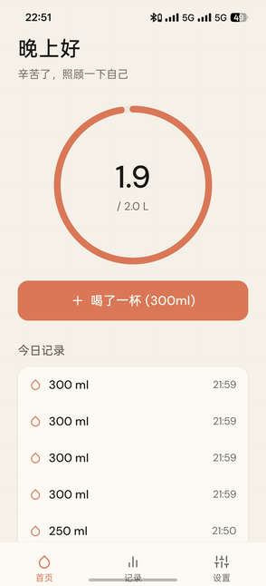
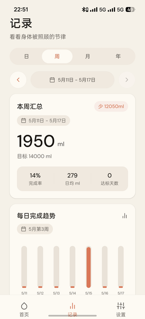
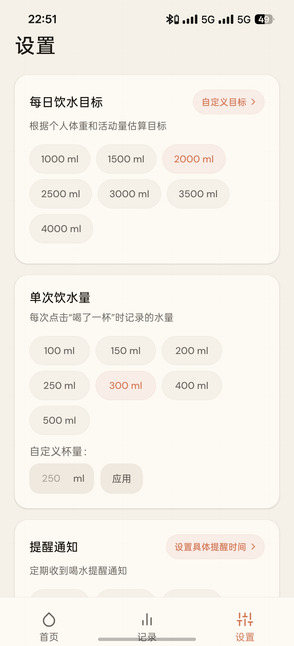

<div align="center">


# Soma · 喝水提醒助手

**温暖、安静、克制的饮水记录应用**

Soma 不把喝水变成焦虑的打卡任务。它用柔和的进度、轻量的记录和本地提醒，帮助你在日常节奏里照顾自己。

[](https://expo.dev/)
[](https://reactnative.dev/)
[](https://www.typescriptlang.org/)
[](#download)
[](#download)
[](#design)
[](#features)
[](#features)
[](#license)

</div>

<br />

<!-- 
  截图占位 — 替换为实际应用截图后取消注释
  建议准备 3 张截图：首页进度、历史统计、设置页面
  推荐尺寸：每张宽度 240px，放在同一行

<div align="center">
  
  &nbsp;&nbsp;
  
  &nbsp;&nbsp;
  
</div>

<br />
-->

## 📦 Download

前往 [GitHub Releases](https://github.com/XuKunyao/Soma-android/releases) 页面下载最新版 APK，安装到 Android 设备即可使用。

当前最新版本为 **v1.1.4**，支持 Android 设备。

## ✨ Features

1、**今日进度：** 首页用柔和的圆形进度环展示当前饮水量和每日目标。打开应用，你只需要关注一件事：今天喝了多少水。整个界面保持克制，不堆砌数据，不制造焦虑。

2、**一键记录：** 点击「喝了一杯」即可记录当前杯量，默认 250ml。你也可以在设置中自定义杯量大小或选择预设规格。今日记录支持左滑删除，饮水总量会同步更新。

3、**历史统计：** 按日、周、月、年查看饮水汇总和趋势。日视图支持分时完成趋势，周、月、年视图使用更贴近日常语义的周期标签。数据展示以回顾节律为目的，帮助你了解自己的饮水习惯，而不是用数字施加压力。

4、**智能目标估算：** 根据体重、性别参考、活动量和饮食习惯，为你生成个性化的每日饮水建议。算法参考《中国居民膳食指南（2022）》的日常饮水量范围，区分「喝水目标」和包含食物水分的「总水摄入」。估算结果仅适合作为健康成年人的日常参考，不替代医疗建议。

5、**智能本地提醒：** 使用系统本地通知按时提醒你喝水。支持设定精确到分钟的多个具体提醒时间（提供美观的开关式卡片列表，支持侧滑删除、独立启停及防误触状态弱化），同时兼容基于间隔的周期提醒和勿扰时间段配置。所有调度在设备本地完成，不依赖任何服务器。

6、**中英双语 & 深色模式：** 界面语言可在中文和英文之间自由切换。外观支持跟随系统的浅色和深色主题，深色模式采用暖灰色调而非纯黑，在夜间使用时温暖不刺眼。

7、**数据备份与导入：** 可以选择本地备份位置，导出 Soma JSON 备份，也可以从同一位置导入最新备份。备份功能适合换机、手动归档或在大版本更新前留一份保险。

8、**隐私优先：** 所有饮水记录和设置数据都保存在设备本地，Soma 不收集任何用户信息，不上传任何数据到服务器。

## 🎨 Design

Soma 的视觉方向追求温暖与克制。色调上避免纯白、纯黑、冷灰和高饱和霓虹色，整体气质像一本安静的生活笔记。动效保持轻柔，按钮和弹窗只提供必要的交互反馈。

核心色彩对照：

| Token | Light | Dark |
| :--- | :--- | :--- |
| Background | `#F5F0E8` | `#1F1A17` |
| Surface | `#FDFAF4` | `#29231F` |
| Primary | `#D97757` | `#E18A68` |
| Text | `#1A1612` | `#F4EFE8` |
| Secondary | `#6B6560` | `#B9AEA5` |
| Border | `#E8E2D9` | `#463D36` |

完整的色彩、字号、间距和阴影定义位于 [`constants/theme.ts`](constants/theme.ts)，采用 DM Sans 字体。

## 🛠 Tech Stack

| 类别 | 技术 |
| :--- | :--- |
| 框架 | [Expo](https://expo.dev/) + [React Native](https://reactnative.dev/) |
| 路由 | [Expo Router](https://docs.expo.dev/router/introduction/) — 基于文件系统的路由与 Tab 导航 |
| 语言 | [TypeScript](https://www.typescriptlang.org/) |
| 状态管理 | React Context + useReducer |
| 本地存储 | [AsyncStorage](https://react-native-async-storage.github.io/async-storage/) |
| 本地通知 | [Expo Notifications](https://docs.expo.dev/versions/latest/sdk/notifications/) |
| 动效 | [Reanimated](https://docs.swmansion.com/react-native-reanimated/) + [Gesture Handler](https://docs.swmansion.com/react-native-gesture-handler/) |
| 图形 | [React Native SVG](https://github.com/software-mansion/react-native-svg) |

## 📁 Project Structure

```
app/
  _layout.tsx                # 根布局：字体加载、通知初始化、全局状态注入
  (tabs)/
    _layout.tsx              # 底部 Tab 导航配置
    index.tsx                # 首页：进度环、快速记录、今日饮水列表
    history.tsx              # 历史：日 / 周 / 月 / 年统计与趋势
    settings.tsx             # 设置：目标估算、杯量、提醒、系统设置分类、备份与更新
components/
  GreetingHeader.tsx         # 基于时间段的问候语
  WaterProgress.tsx          # SVG 圆形饮水进度组件
  WaterLogItem.tsx           # 单条饮水记录（支持左滑删除）
constants/
  theme.ts                   # 设计系统：色彩、字号、圆角、阴影、间距
contexts/
  WaterContext.tsx            # 全局饮水状态管理（Context + useReducer）
hooks/
  useAppTheme.ts             # 主题 Hook：跟随系统深浅色
utils/
  notifications.ts           # 本地通知调度与权限管理
  storage.ts                 # AsyncStorage 数据读写封装
```

## 💻 Development

如果你想在本地构建和调试 Soma，需要 Node.js 18+ 环境。

```bash
# 克隆仓库
git clone https://github.com/XuKunyao/Soma-android.git
cd Soma-android

# 安装依赖
npm install

# 启动 Expo 开发服务器，扫码或连接模拟器预览
npx expo start
```

> Expo Go 适合预览界面和基础交互。通知、启动页和应用图标等原生能力，需要 [development build](https://docs.expo.dev/develop/development-builds/introduction/) 才能完整验证。

## 🗺 Roadmap

- [ ] 空状态与场景插图补充
- [ ] 饮水成就与里程碑系统
- [ ] Widget 桌面小组件
- [x] 数据导出与备份
- [x] 系统设置分类与检查更新

## License

[MIT](LICENSE) © Soma
